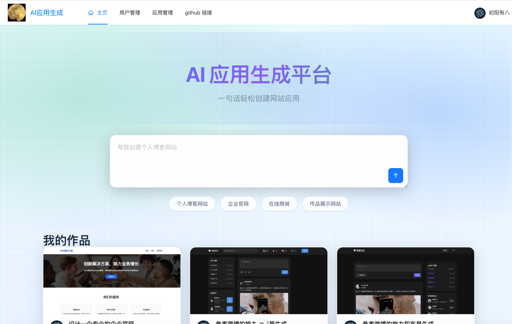
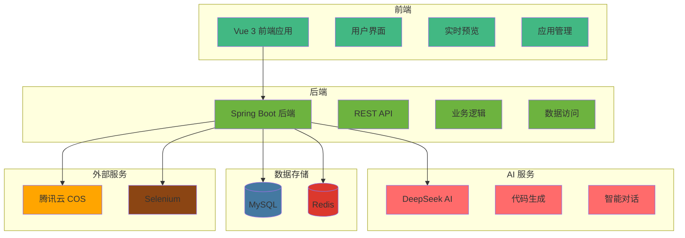

# How AI Code Mother - AI 零代码应用生成平台

[](https://openjdk.java.net/projects/jdk/21/)
[](https://spring.io/projects/spring-boot)
[](https://vuejs.org/)
[](https://www.typescriptlang.org/)
[](LICENSE)

> 一个基于 AI 的零代码应用生成平台，通过自然语言对话快速生成网站应用

## 🌟 项目简介

How AI Code Mother 是一个创新的 AI 驱动的零代码应用生成平台。用户只需通过自然语言描述需求，AI 就能自动生成完整的网站应用，包括前端界面、交互逻辑和部署配置。


### 在线体验：[howmoon.cn](https://howmoon.cn/)

### ✨ 亮点速览

- 对话即开发：一句话发起生成，边流式输出边预览
- 工作流编排：初始化 → 图片收集 → 提示词增强 → 智能路由 → 代码生成 → 质检 → 构建/部署
- Agent 工具流：自动写文件
- 可视化编辑：在预览页开启编辑模式，选中元素即可 `contentEditable` 就地修改
- 一键部署：生成后直接打包 + 上传，获取可访问链接


### 🧭 工作流一览

1. 初始化：接收原始需求与上下文
2. 图片收集：并发搜索/生成站内素材（内容图、插画、图标/Logo 等）
3. 提示词增强：将图片/约束合并进更强的 Prompt
4. 智能路由：按需求自动选择生成类型（HTML/多文件/Vue 项目）
5. 代码生成：流式输出代码；在 Vue 项目模式下通过工具写入至项目结构
6. 代码质量检查：静态校验/规则检查，不通过则回流修复
7. 构建/部署：Vue 项目自动打包并推送，可直接在线访问

### 🧪 三步上手

1. 首页输入一句描述并创建应用
2. 进入聊天页，和 AI 继续描述你想要的样式/模块
3. 右侧实时预览成品；需要时点击“部署”立即上线


### 核心特性

- 🤖 **AI 驱动**：基于 DeepSeek 大语言模型，智能理解用户需求
- 💬 **对话式开发**：通过自然语言对话生成应用
- 🚀 **实时预览**：生成过程中实时查看应用效果
- 📱 **多端适配**：生成的网站支持响应式设计
- 🎨 **多样化模板**：支持多种应用类型和样式
- 🔧 **一键部署**：快速部署到云端，立即可用
- 👥 **用户管理**：完整的用户注册、登录、权限管理
- 📊 **应用管理**：个人应用管理、精选应用推荐

## 🏗️ 系统架构



## 🛠️ 技术栈

### 后端技术栈

- **框架**: Spring Boot 3.5.4
- **语言**: Java 21
- **数据库**: MySQL 8.0+
- **缓存**: Redis
- **ORM**: MyBatis-Flex
- **AI 集成**: LangChain4j
- **API 文档**: Knife4j (Swagger)
- **对象存储**: 腾讯云 COS
- **网页截图**: Selenium

### 前端技术栈

- **框架**: Vue 3.5.17 + TypeScript 5.8
- **UI 组件**: Ant Design Vue 4.2.6
- **构建工具**: Vite 7.0
- **状态管理**: Pinia 3.0.3
- **路由**: Vue Router 4.5.1
- **HTTP 客户端**: Axios 1.11.0
- **Markdown 渲染**: markdown-it 14.1.0

## 📦 快速开始

### 环境要求

- **Java**: 21+
- **Node.js**: 18+
- **MySQL**: 8.0+
- **Redis**: 6.0+
- **Maven**: 3.8+

### 1. 克隆项目

```bash
git clone https://github.com/usersx/how-ai-code-mother.git
cd how-ai-code-mother
```

### 2. 后端配置

#### 数据库配置

1. 创建 MySQL 数据库：

```sql
CREATE DATABASE how_ai_code_mother CHARACTER SET utf8mb4 COLLATE utf8mb4_unicode_ci;
```

2. 执行数据库初始化脚本：

```bash
mysql -u root -p how_ai_code_mother < sql/creat_table.sql
```

#### 配置文件

修改 `src/main/resources/application.yml`：

```yaml
spring:
  datasource:
    url: jdbc:mysql://localhost:3306/how_ai_code_mother
    username: your_username
    password: your_password
  data:
    redis:
      host: localhost
      port: 6379
      password: your_redis_password

langchain4j:
  open-ai:
    chat-model:
      api-key: your_deepseek_api_key
    streaming-chat-model:
      api-key: your_deepseek_api_key

cos:
  client:
    secretId: your_cos_secret_id
    secretKey: your_cos_secret_key
```

#### 启动后端

```bash
# 编译项目
mvn clean compile

# 启动应用
mvn spring-boot:run
```

后端服务将在 `http://localhost:8123/api` 启动

### 3. 前端配置

```bash
cd how-ai-code-mother-fronted

# 安装依赖
npm install

# 启动开发服务器
npm run dev
```

前端服务将在 `http://localhost:5173` 启动

### 4. 访问应用

- **前端地址**: http://localhost:5173
- **API 文档**: http://localhost:8123/api/doc.html

- **线上地址**: [howmoon.cn](https://howmoon.cn/)

## 🚀 功能特性

### 用户功能

#### 应用创建与管理

- 🎯 **智能应用生成**: 通过自然语言描述创建应用
- 💬 **AI 对话开发**: 与 AI 实时对话，逐步完善应用
- 👀 **实时预览**: 生成过程中实时查看应用效果
- 📝 **应用编辑**: 修改应用名称、封面等信息
- 🗑️ **应用删除**: 管理个人应用列表

#### 应用部署

- 🚀 **一键部署**: 快速部署应用到云端
- 🌐 **在线访问**: 获得可访问的 URL 地址
- 📱 **响应式设计**: 自动适配各种设备

#### 应用发现

- ⭐ **精选应用**: 浏览精选推荐的应用
- 🔍 **应用搜索**: 根据名称搜索应用
- 📋 **分页浏览**: 支持分页查看应用列表

### 管理员功能

#### 应用管理

- 🔧 **应用审核**: 审核和管理所有应用
- ✏️ **应用编辑**: 编辑任意应用信息
- ⭐ **精选设置**: 设置应用为精选推荐
- 📊 **应用统计**: 查看应用使用统计

#### 用户管理

- 👥 **用户列表**: 查看所有注册用户
- 🔐 **权限管理**: 管理用户权限
- 📈 **用户统计**: 用户活跃度统计

## 📁 项目结构

```
how-ai-code-mother/
├── how-ai-code-mother-fronted/         # 前端（Vue 3 + Vite + TS）
│   ├── public/                         # 静态资源（如：主页.png）
│   ├── src/
│   │   ├── api/                        # 后端 OpenAPI 封装
│   │   ├── assets/                     # 图片等静态资源
│   │   ├── components/                 # 通用组件（MarkdownRenderer、AppCard 等）
│   │   ├── pages/                      # 页面
│   │   │   ├── app/                    # 应用聊天/编辑等
│   │   │   ├── admin/                  # 管理端页面
│   │   │   └── user/                   # 用户登录/注册/资料
│   │   ├── router/                     # 路由
│   │   ├── stores/                     # Pinia 状态
│   │   ├── utils/                      # 工具（可视化编辑器等）
│   │   └── config/                     # 环境配置
│   ├── vite.config.ts
│   └── package.json
│
├── src/                                # 后端（Spring Boot）
│   ├── main/
│   │   ├── java/com/howmoon/howaicodemother/
│   │   │   ├── HowAiCodeMotherApplication.java
│   │   │   ├── ai/                     # AI 接入与模型装配
│   │   │   │   ├── tools/              # Agent 工具（读/写文件等）
│   │   │   │   ├── model/              # AI 结构化返回模型
│   │   │   │   └── guardrail/          # 输入/输出护轨
│   │   │   ├── controller/             # 控制器（App/User/Workflow 等）
│   │   │   ├── core/                   # 代码解析/保存/构建 等核心流程
│   │   │   │   ├── handler/            # 流式处理器（SSE/TokenStream）
│   │   │   │   ├── parser/             # 代码解析器
│   │   │   │   ├── saver/              # 代码保存策略
│   │   │   │   └── builder/            # 项目构建（Vue 项目打包）
│   │   │   ├── langgraph4j/            # 工作流（节点/工具/状态）
│   │   │   │   ├── node/               # 工作流节点（收集/增强/生成/质检/构建）
│   │   │   │   ├── tools/              # 工作流专用工具
│   │   │   │   ├── model/              # 工作流模型/结果
│   │   │   │   ├── ai/                 # 工作流使用的 AI Service 封装
│   │   │   │   └── state/              # 工作流上下文
│   │   │   ├── service/                # 业务服务与实现
│   │   │   ├── manager/                # 资源管理（COS 等）
│   │   │   ├── mapper/                 # MyBatis 映射
│   │   │   ├── model/                  # DTO/Entity/VO/Enum
│   │   │   ├── exception/              # 全局异常
│   │   │   ├── config/                 # Spring 配置
│   │   │   └── utils/                  # 工具类
│   │   └── resources/
│   │       ├── application.yml         # 配置文件
│   │       ├── mapper/                 # XML 映射文件
│   │       ├── prompt/                 # 系统 Prompt 模板
│   │       └── static/                 # 静态页面（调试用）
│   └── test/java/…                     # 单元/集成测试
│
├── sql/                                # 数据库脚本
│   └── creat_table.sql
├── pom.xml
└── README.md
```

> 说明：前端与后端位于同一仓库，便于一键拉起与联调。工作流相关代码集中在 `langgraph4j` 包，Agent 工具与护轨位于 `ai/tools` 与 `ai/guardrail`。

## 🔧 开发指南

### 后端开发

#### 代码生成

使用 MyBatis-Flex 代码生成器：

```bash
# 运行代码生成器
mvn exec:java -Dexec.mainClass="com.howmoon.howaicodemother.generator.MyBatisCodeGenerator"
```

#### API 开发

1. 在 `controller` 包下创建控制器
2. 在 `service` 包下实现业务逻辑
3. 在 `mapper` 包下定义数据访问接口
4. 在 `model` 包下定义数据模型

#### 测试

```bash
# 运行单元测试
mvn test

# 运行集成测试
mvn verify
```

### 前端开发

#### 开发模式

```bash
# 启动开发服务器
npm run dev

# 类型检查
npm run type-check

# 代码检查
npm run lint

# 格式化代码
npm run format
```

#### 构建部署

```bash
# 构建生产版本
npm run build

# 预览构建结果
npm run preview
```

## 🔐 环境变量

### 必需的环境变量

```bash
# 数据库配置
MYSQL_URL=jdbc:mysql://localhost:3306/how_ai_code_mother
MYSQL_USERNAME=your_username
MYSQL_PASSWORD=your_password

# Redis 配置
REDIS_HOST=localhost
REDIS_PORT=6379
REDIS_PASSWORD=your_redis_password

# AI API 配置
DEEPSEEK_API_KEY=your_deepseek_api_key

# 腾讯云 COS 配置
COS_SECRET_ID=your_cos_secret_id
COS_SECRET_KEY=your_cos_secret_key
COS_BUCKET=your_cos_bucket
COS_REGION=ap-shanghai
```

## 🚀 部署指南

### Docker 部署

#### 1. 构建镜像

```bash
# 构建后端镜像
docker build -t how-ai-code-mother-backend .

# 构建前端镜像
cd how-ai-code-mother-fronted
docker build -t how-ai-code-mother-frontend .
```

#### 2. 使用 Docker Compose

创建 `docker-compose.yml`：

```yaml
version: '3.8'
services:
  mysql:
    image: mysql:8.0
    environment:
      MYSQL_ROOT_PASSWORD: your_password
      MYSQL_DATABASE: how_ai_code_mother
    volumes:
      - mysql_data:/var/lib/mysql
    ports:
      - "3306:3306"

  redis:
    image: redis:6.0
    ports:
      - "6379:6379"

  backend:
    image: how-ai-code-mother-backend
    depends_on:
      - mysql
      - redis
    environment:
      SPRING_DATASOURCE_URL: jdbc:mysql://mysql:3306/how_ai_code_mother
      SPRING_REDIS_HOST: redis
    ports:
      - "8123:8123"

  frontend:
    image: how-ai-code-mother-frontend
    ports:
      - "80:80"
    depends_on:
      - backend

volumes:
  mysql_data:
```

#### 3. 启动服务

```bash
docker-compose up -d
```

### 传统部署

#### 1. 后端部署

```bash
# 打包
mvn clean package -DskipTests

# 运行
java -jar target/how-ai-code-mother-0.0.1-SNAPSHOT.jar
```

#### 2. 前端部署

```bash
# 构建
npm run build

# 部署到 Nginx
cp -r dist/* /var/www/html/
```

## 🤝 贡献指南

我们欢迎所有形式的贡献！请遵循以下步骤：

1. **Fork** 本仓库
2. 创建特性分支 (`git checkout -b feature/AmazingFeature`)
3. 提交更改 (`git commit -m 'Add some AmazingFeature'`)
4. 推送到分支 (`git push origin feature/AmazingFeature`)
5. 打开 **Pull Request**

### 开发规范

- 遵循代码规范，使用 ESLint 和 Prettier
- 编写单元测试，确保代码质量
- 更新文档，说明新功能
- 遵循 Git 提交规范

## 📄 许可证

本项目采用 MIT 许可证 - 查看 [LICENSE](LICENSE) 文件了解详情


## 📞 联系我

- **项目地址**: https://github.com/your-username/how-ai-code-mother
- **问题反馈**: https://github.com/your-username/how-ai-code-mother/issues
- **邮箱**: 984202455@qq.com

---

⭐ 如果这个项目对你有帮助，请给我们一个 Star！
